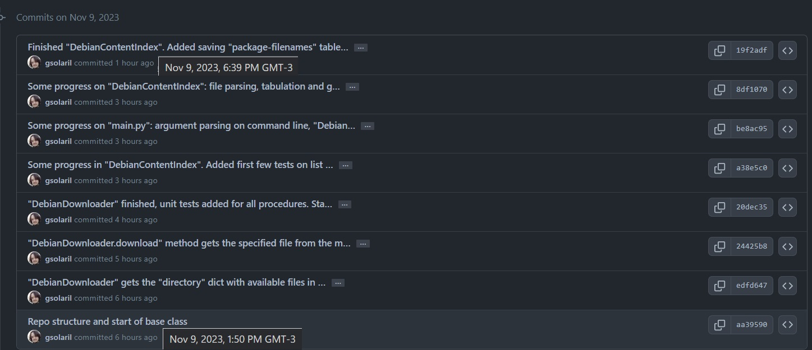

<center><b><u><h3><font color = "blue">Exercise instructions</font></h3></b></u></center>

Debian uses "<code>*.deb</code>" packages to deploy and upgrade software. The packages are stored in repositories and each repository contains the so called "<b>Contents index</b>". The format of that file is well described <b><u><a href = "https://wiki.debian.org/RepositoryFormat#A.22Contents.22_indices" target = "_blank">here</a></b></u>

Your task is to develop a python command line tool that takes the architecture (amd64, arm64, mips etc.) as an argument and downloads the compressed Contents file associated with it from a Debian mirror. The program should parse the file and output the statistics of the top 10 packages that have the most files associated with them. An example output could be:


<h4><blockquote> >> <code>./package_statistics.py amd64</code>

<br><code>Result:<table class="tg"><thead></thead></h4>
<tbody><tr><td>&lt;package name 1&gt;</td><td>&lt;number of files&gt;</td></tr>
  </tr><tr><td>&lt;package name 2&gt;</td><td>&lt;number of files&gt;</td></tr>
  </tr><tr><td><center>...</center></td><td><center>...</center></td>
  </tr><tr><td>&lt;package name 10&gt;</td><td>&lt;number of files&gt;</td></tr>
</tbody></table></code>
</blockquote>

You can use <b><u><a href = "http://ftp.uk.debian.org/debian/dists/stable/main/" target = "_blank">this Debian mirror</a></b></u>. 

Please try to follow modern Python best practices in your solution (write your solution at the kind of standard you would yourself like to maintain and see from your colleagues). <b><u>Hint</u></b>: there are tools that can help you verify your code is compliant. In-line comments are appreciated.

Please do your work in a local Git repository. Your repo should contain a README that explains your thought process and approach to the problem, and roughly how much time you spent on the exercise. When you are finished, create a "<code>tar.gz</code>" of your repo and submit it to the link included in this email. Please do not make the repository publicly available.

Note: We are interested not only in quality code, but also in seeing your approach to the problem and how you organise your work.

<center><b><u><h3><font color = "blue">Resolution</font></h3></b></u></center>

<b><u><h3>How to use</h3></b></u>

<ol><li>Install dependencies. Create a virtual environment first, if desired.
<br><br>

<blockquote> >> <code>pip3 install -r requirements.txt</code></blockquote><br>
</li><li>Clone the repository to the local environment. Make sure to keep the original structure, and to include the "<code>temp</code>" folder.<br><br>

</li><li>Run "<code>main.py</code>" Python file. Available arguments are as follows:<br><br>

<blockquote> >> <code>python3 ./main.py [arch] [-n int] [-j]</code></blockquote><br>

<b><u>Where</u></b>:<br>
<ul><li>"<code>arch</code>" is the name of the architecture to be indexed and ranked. <br>This parameter is <u>positional</u> and also <u>optional</u>: when not given, the local machine architecture will be used as input.
</li><li>"<code>-n/--top</code>" is the amount of packages to appear on the rank.<br>E.g: "<code>--top 20</code>" will display the <b>20</b> packages of the chosen architecture with the largest amount of files. <br>This parameter is <u>named</u> and <u>optional</u> as well: when not specified, will be set as <b>10</b> by default.
</li><li>"<code>-j/--json</code>" will store a "<code>JSON</code>" file where the keys are the indexed packages and the values are the list of all of the files associated to such package. <br>This parameter is <u>named</u> and <u>optional</u> but is a <u>flag</u> doesn't need any input value.
</li></ul>

</li><li>Output will be similar to the following print:

```
–––––––––––––––––––––––––––––––––––––––––––––––––––––––––––––––––––––––––––––––––––––––––––––––
Ranking of the largest top 5 packages in the Debian distribution for given architecture "amd64"
(based on file count - amount of files in package)

Package name                 File count
‾‾‾‾‾‾‾‾‾‾‾‾‾‾‾‾‾‾‾‾‾‾‾‾‾‾‾‾‾‾‾‾‾‾‾‾‾‾‾‾‾‾‾
devel/piglit                 53007
science/esys-particle        18408
math/acl2-books              16907
libdevel/libboost1.81-dev    15456
libdevel/libboost1.74-dev    14333
–––––––––––––––––––––––––––––––––––––––––––––––––––––––––––––––––––––––––––––––––––––––––––––––
```

</li><li>(<u>Optional</u>): If having used the JSON flag, Locate the stored JSON file with the given architecture as filename, inside the "<code>temp</code>" folder. Watch out for its size.<br>A sample of such file's structure can be:

```
{
    "admin/0install": [
        "usr/lib/0install.net/gui_gtk.cmxs",
        "usr/share/applications/0install.desktop",
        "usr/share/doc/0install"
    ],
    "admin/0install-core": [
        "usr/bin/0alias",
        "usr/bin/0desktop",
        "usr/bin/0install",
        ...
    ...
```
<b><u>Where</u></b>:
<ul><li>the <b><u>keys</u></b> are each existent package (e.g.: "<code>admin/0install-core</code>")
</li><li>the <b><u>values</u></b> hold a list of all files that are included in such package. (e.g.: "<code>usr/bin/0alias</code>")

</li></ol>

<b><u><h3>How to test</h3></b></u>

Run both unit test files by UI or by command line held in "<code>tests</code>" folder.

<blockquote> >> <code>python ./tests/test_base.py</code><br>
>> <code>python ./tests/test_content.py</code></blockquote><br>

Otherwise you can also modify the main block ("<code>if \_\_name\_\_ == "\_\_main\_\_": ...</code>") of each file in "<code>code</code>" folder to do your own manual testing.

<b><u><h3>About the solution model</h3></b></u>

Repo structure is quite simple: consists of 4 folders: "<code>core</code>", "<code>temp</code>", "<code>tests</code>" and "<code>utils</code>".
<ol><li>Folder "<b><u><code>core</code></u></b>" holds two files:
<ul><li>"<code>base</code>" file contains a base class called "<code>DebianDownloader</code>" which manipulates the mirror website. It parses its HTML code and manages the HTTP requests for retrieval of necessary content-index files through the "<code>download</code>" method.
</li><li>"<code>content</code>" file contains a children class called "<code>DebianContextIndex</code>" which inherits the former class' methods, but focuses on content-index files of given architectures. It takes care of the parsing and stats' processing.
</li></ul>
</li><li>Folder "<code>tests</code>" holds two test files, one for each of the aforementioned classes. It focuses on...
<ul><li>The <u>structure</u> (e.g.: is the list, a list?),
</li><li>The content (is the top-10 ranking, of size 10?),
</li><li>And validation of certain individual items (is top package "<code>devel/piglit</code>", the one with most files?)
</li></ul>...for each one of the core attributes of the instances (file content, stored files, package-filenames table, etc).
</li><li>Folder "<code>temp</code>" holds all of the files that are created by the scripts themselves. There's only a real need for the "<code>test_content_verify.txt</code>" because it's part of one unit test. Otherwise it's just a "landing folder".
</li><li>Folder "<code>utils</code>" holds one "<code>constants.py</code>" file which contains some needed fixed stuff for the scripts to work. For example: we identify the local machine architecture through the "<a href = "https://docs.python.org/3/library/platform.html" target = "_blank">platform</a>" library and set it as the default value for the architecture argument.
</li></ol>

<b><u><h3>Use of Pandas</h3></b></u>

It was chosen as a fast and easy solution for the file's parsing, because:
<ul><li>The content-index files are naturally structured as tables.
</li><li>the row-splitting functionalities are straightforward and work en-masse.
</li><li>It's very easy to group either "packages associated to each file" or "files associated to each package".
</li></ul>

About this 3rd item: Notice that the former defines the file structure, and the latter is needed for the ranking. That's why that's the exact order of operations in the "<code>DebianContentIndex</code>" instantiation procedure, which defines the two tables:
<ul><li>"<code>DebianContentIndex.table_file_packs</code>": list of <u>packages</u> associated to each <u>file</u>.
</li><li>"<code>DebianContentIndex.table_pack_files</code>": list of <u>files</u> associated to each <u>package</u>.
</ul></li>

<b>The final ranking, in the end, is just about sorting the latter table according to the length of such lists.</b>

<b><u><h3>Workload and timing</h3></b></u>

So it's 8 pm right now. The whole coding process took a bit more than 4 hours. I created the repo around midday, then went for lunch and started coding around 2 pm. Took a 30-minute break halfway through the task after finishing the "base" class tests. Then finished both classes and unit tests around 6:30 and then took a 1-hour break. I'm only left with the "README.md" file which I have been writing for around 1 hour, trying to be as detailed and accurate as possible in everything.

Github repository is set as private, as instructions requested for. However, I am sharing a timeline of each Git commit so as to provide insight about the project management.

</img>